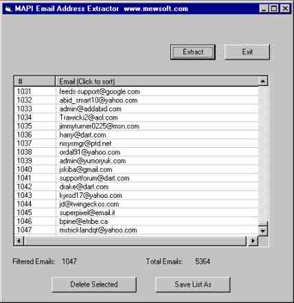



## Outlook \(and Express\) and MAPI Inbox Email Addresses Extractor

### Description

Extract all senders email addresses from your mail client Inbox folder like Outlook and Outlook Express to a text file and removes duplicates.
 
### More Info
 

             |
---                |---
**Submitted On**   |2005-03-24 15:51:02
**By**             |[Ahmed Amin Elsheshtawy](https://github.com/Planet-Source-Code/PSCIndex/blob/master/ByAuthor/ahmed-amin-elsheshtawy.md)
**Level**          |Intermediate
**User Rating**    |4.3 (13 globes from 3 users)
**Compatibility**  |VB 6\.0
**Category**       |[Complete Applications](https://github.com/Planet-Source-Code/PSCIndex/blob/master/ByCategory/complete-applications__1-27.md)
**World**          |[Visual Basic](https://github.com/Planet-Source-Code/PSCIndex/blob/master/ByWorld/visual-basic.md)
**Archive File**   |[Outlook\_\(a1867623242005\.zip](https://github.com/Planet-Source-Code/ahmed-amin-elsheshtawy-outlook-and-express-and-mapi-inbox-email-addresses-extractor__1-59623/archive/master.zip)

